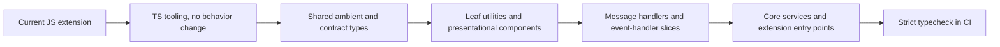

## Background & Goals

The App Connect client is a Chrome Manifest V3 browser extension built with esbuild and tested with Vitest and Playwright. Historical migration baseline:

- `src/`: 247 `.js` files and 7 `.jsx` files.
- `test/` and `e2e/`: 78 `.js` files and 3 `.jsx` files.
- Build entry points are `src/content.js`, `src/popup.js`, `src/sw.js`, and `src/root.jsx` in `build.js`.
- Vitest currently treats source `.js` files as JSX through `vitest.config.mjs`.
- There is no `tsconfig` or TypeScript dependency in `package.json`.
- Existing quality gates are `npm test`, `npm run build`, `npm run test:e2e`, and `npm run test:coverage`.

Current migration state:

- `src/`, `test/`, `e2e/`, and root project tooling are TypeScript or TSX.
- Build entry points are `src/content.ts`, `src/popup.ts`, `src/sw.ts`, and `src/root.tsx` in `build.ts`.
- Vitest and Playwright configs are TypeScript.
- `allowJs` is disabled in `tsconfig.json`.
- Test and E2E files no longer use `@ts-nocheck`; their runtime correctness is guarded by Vitest and Playwright.
- `npm run lint` covers `src`, `build.ts`, `updateVersion.ts`, and `eslint.config.ts`.
- `strict` mode is enabled with explicit transitional exceptions for `noImplicitAny`, `strictNullChecks`, `strictPropertyInitialization`, and `useUnknownInCatchVariables`.
- Extension runtime output filenames remain JavaScript in `dist/` and `public/manifest.json`.
- `public/**/*.js` is treated as copied dependency/runtime asset content and is intentionally excluded from source conversion scope.

Goal: introduce TypeScript as an incremental safety layer while preserving the current extension runtime behavior, build outputs, and framework stack. The migration MUST make runtime behavior safer to change, not destabilize the browser extension.

## Non-Goals

- Do not rewrite the extension architecture, event-router framework, service worker lifecycle, or widget integration as part of the TypeScript migration.
- Do not upgrade React, Juno, esbuild, Vitest, Playwright, or the Chrome extension manifest model unless a separate reviewed change requires it.
- Do not change `public/manifest.json` permissions, `manifest_version`, content-script match policy, externally connectable hosts, or extension output filenames as part of type conversion.
- Do not change App Connect server APIs, platform manifest behavior, CRM connector behavior, or message payload semantics.
- Do not introduce a package-manager migration or lockfile policy change in the same PR as TypeScript enablement. The repository currently has no lockfile; dependency reproducibility needs a separate owner decision.

## Migration Principles

- The migration MUST be incremental. JavaScript and TypeScript must coexist until each area is converted and verified.
- Type conversion PRs MUST NOT bundle feature behavior changes.
- Tests MUST remain enabled. Do not skip, weaken, or delete tests to make type conversion pass.
- The build MUST keep emitting the same extension-facing bundle names: `content.js`, `popup.js`, `sw.js`, and the root/options bundle expected by copied `public` assets.
- Existing `.js` import specifiers in tests and app code MUST be handled before source files are renamed. Prefer normalizing local imports to extensionless paths in a tested preparatory PR over relying on hidden resolver aliases.
- TypeScript strictness SHOULD tighten in stages. Early phases may use permissive interop settings; final phases should make type checks meaningful enough to block unsafe changes.
- Runtime boundary data from Chrome APIs, `window.postMessage`, iframe/widget messages, storage, server manifests, and CRM responses MUST be treated as untrusted or partially known at the edge.

## System Behavior

The migration affects tooling and source language only. Runtime message flow remains the existing extension flow documented in `src/eventHandlers/ARCHITECTURE.md`.

What this shows: TypeScript is introduced beside the current system first, then expanded inward from stable contracts and leaf modules.

## Business Rules

- TypeScript migration MUST NOT change how users open the popup, use click-to-dial, receive incoming-call notifications, log calls/messages, configure CRM platforms, or interact with embedded/widget pages.
- The service worker MUST continue to satisfy MV3 lifecycle constraints. No conversion PR may add long-lived assumptions that break event-driven service worker startup.
- Content-script behavior MUST remain compatible with arbitrary CRM pages, shadow DOM click-to-dial handling, and the configured URL activation rules.
- Popup and iframe messaging MUST preserve current `data.type`, `data.path`, `requestId`, and response semantics unless a separate feature spec changes the contract.
- Storage key names and serialized storage shapes MUST remain backward-compatible during migration.

## Technical Design

### Phase 0: Baseline and Safety Net

Establish a verified baseline before changing tooling.

- Run and record current results for `npm test`, `npm run build`, and `npm run test:e2e`.
- Confirm the current generated extension can load from `dist/`.
- Capture known warnings or flaky tests before migration starts.
- Identify import specifiers that explicitly reference `.js` source files so renames do not break Vitest or browser bundling.

Exit gate: baseline quality gates pass or known failures are documented with owner approval.

### Phase 1: Add Dormant TypeScript Tooling

Add TypeScript without converting runtime behavior.

- Add `typescript` and narrowly needed type packages such as React 17, React DOM 17, and Chrome extension types.
- Add a `tsconfig.json` that supports browser extension code, JSX automatic runtime, JSON imports, JavaScript coexistence, and `noEmit`.
- Add `npm run typecheck` as a separate command. It can start non-blocking until the first converted slices are stable.
- Add declaration files for current globals such as `chrome`, `RCAdapter`, `window.RingCentralC2D`, `window.clickToDialInject`, and E2E/test-only globals.
- Update esbuild and Vitest config only enough to accept `.ts` and `.tsx` files while preserving the current `.js`-as-JSX behavior.

Exit gate: `npm test`, `npm run build`, `npm run test:e2e`, and `npm run typecheck` pass for the initial config.

### Phase 2: Type the Boundaries First

Create shared type contracts before renaming behavior-heavy files.

- Add type-only definitions for extension messages, widget postMessage payloads, Chrome storage keys, platform manifest fragments, user/admin settings, log payloads, and call/message events.
- Use the existing event-handler architecture doc and current tests as the source for message-routing contracts. Do not hand-copy every handler detail into docs.
- Keep external API and CRM payloads typed conservatively at first. Prefer `unknown` at the IO boundary and narrow before internal use.
- Avoid broad `any`, sweeping `// @ts-ignore`, or casts that hide contract uncertainty. When a boundary is not known, mark it for follow-up in code or tests.

Exit gate: type declarations compile and at least one focused test suite exercises each newly typed boundary.

### Phase 3: Convert Low-Risk Leaves

Start with files that are well-covered and have limited side effects.

Good first candidates:

- Pure or mostly pure utilities in `src/lib`, such as URL template, appointment utilities, log utilities, and C2D DOM helpers.
- Small service helpers with focused unit tests.
- Leaf React components that do not own routing or browser-extension side effects.
- Test helpers and mocks only after their dependent suites are stable.

Conversion rule: each PR should convert a small slice, update imports safely, and keep behavior unchanged.

Exit gate for each slice: focused tests, full `npm test`, `npm run build`, and typecheck pass.

### Phase 4: Convert Message and Event Handler Slices

Move through the event-driven surface by route group, not by mechanical folder rename.

- Convert `messageHandlers` slices after shared message types exist.
- Convert `src/eventHandlers/rc-post-message-request` subrouters by `data.path` group.
- Convert top-level notify handlers by `data.type` group.
- Preserve the router behavior in `popup.js`; router refactors need separate review.
- Use discriminated unions for message payloads where tests confirm the contract.

Exit gate for each handler group: related handler tests, `test/popup/popupRuntime.test.js`, full unit suite, build, and extension E2E pass when the slice affects runtime messaging.

### Phase 5: Convert Core, Services, and Entry Points

Convert higher-risk modules only after contract and handler types have stabilized.

- Convert `src/core` and `src/service` modules after their payload and storage types exist.
- Convert `src/content.ts`, `src/popup.ts`, `src/sw.ts`, and `src/root.tsx` last because they own extension runtime startup.
- Preserve esbuild output filenames when entry files are renamed to `.ts` or `.tsx`.
- Keep `build.ts` and `updateVersion.ts` covered by Node-oriented tests because they own packaging and versioning behavior.

Exit gate: full unit/integration tests, `npm run build`, `npm run test:e2e`, and manual unpacked-extension smoke verification.

### Phase 6: Tighten Type Safety

After most runtime code is converted and stable:

- Make `npm run typecheck` a required CI/pre-merge gate.
- Keep `strict` enabled.
- Remove transitional strict exceptions for `noImplicitAny`, `strictNullChecks`, `strictPropertyInitialization`, and `useUnknownInCatchVariables` only after explicit App Connect payload/schema/storage type models exist.
- Reduce remaining `any` and type assertions at internal boundaries.
- Keep explicit escape hatches only at integration edges, with comments explaining the boundary uncertainty.
- Keep tests, E2E, and build scripts in TypeScript.

Exit gate: strictness target accepted by owner and enforced in CI.

## Compatibility Strategy

- Preserve JavaScript interoperability through `allowJs` during migration.
- Preserve current esbuild bundling and copied `public` assets.
- Preserve current Vitest/jsdom setup and Chrome mock behavior.
- Normalize explicit `.js` local imports before file renames where needed.
- Keep generated `dist` artifact structure compatible with `public/manifest.json`.
- Keep runtime payload shapes backward-compatible with existing stored data and App Connect server expectations.

## Test Strategy

Required gates:

| Change type | Required verification |
| --- | --- |
| Tooling-only TS setup | `npm test`, `npm run build`, `npm run test:e2e`, `npm run typecheck` |
| Leaf utility/component conversion | Focused tests, `npm test`, `npm run build`, `npm run typecheck` |
| Event/message handler conversion | Focused handler tests, `test/popup/popupRuntime.test.js`, `npm test`, `npm run build`, `npm run test:e2e`, `npm run typecheck` |
| Service worker/content/popup entry conversion | Service worker tests, content tests, popup tests, `npm test`, `npm run build`, `npm run test:e2e`, unpacked-extension smoke test |
| Strictness increase | `npm test`, `npm run build`, `npm run test:e2e`, `npm run test:coverage`, `npm run typecheck` |

Tests that already guard high-risk areas:

- Service worker behavior: `test/serviceWorker/*`
- Popup runtime messaging: `test/popup/popupRuntime.test.js`
- Content script and click-to-dial behavior: `test/content/*`, `test/lib/c2d/*`
- Event routers and handlers: `test/eventHandlers/*`
- Message handlers: `test/messageHandlers/*`
- Extension E2E smoke: `e2e/client-extension.spec.js`

## Rollout & Rollback

- Roll out through small PRs, each with one migration slice and no behavior changes.
- Keep TypeScript tooling changes separate from source conversion.
- If a source conversion breaks runtime behavior, revert that slice PR rather than backing out the entire TypeScript setup.
- Keep JS/TS coexistence until the last conversion phase so individual files can be reverted without destabilizing the build.
- If entry-point conversion fails in E2E or manual smoke, restore the entry file extension and esbuild entry path while keeping lower-risk converted modules.

## Monitoring & Alerts

This is a build-time and source-language migration, so the primary monitoring is pre-release verification. For release builds that include converted entry points, reviewer should manually confirm:

- The unpacked extension loads from `dist/`.
- Popup opens and registers the embedded widget.
- Content script initializes on a fixture CRM page.
- Click-to-dial, click-to-SMS, and scheduled callback flows still reach the popup/service worker.
- Incoming-call notification behavior remains intact.

Runtime production monitoring for extension errors is NEEDS_REVIEW because the repository sources inspected here do not show a dedicated release telemetry gate for converted builds.

## Reviewer Focus

- Any PR that touches `build.ts`, `vitest.config.ts`, `public/manifest.json`, `src/sw.ts`, `src/content.ts`, or `src/popup.ts` requires extra review.
- Reject migration PRs that combine type conversion with feature logic changes.
- Watch for hidden behavior changes from default exports, CommonJS/ESM interop, JSX transform differences, JSON imports, and explicit `.js` test imports.
- Watch for unsafe casts around Chrome storage, widget messages, server manifest data, CRM API responses, and DOM globals.
- Confirm no tests are skipped or loosened to pass conversion.

## Agent Constraints

- Do not perform a big-bang rename of `src`.
- Do not change framework versions, extension permissions, or manifest semantics as part of this migration.
- Do not delete existing tests or reduce assertions.
- Do not add broad `any` as a substitute for understanding a contract.
- Do not move files across architectural boundaries while converting them.
- Before editing a migration slice, read the relevant tests and run the focused suite after the change.

## Open Decisions

- `NEEDS_OWNER`: confirm the owning team/person for the migration and final approval.
- `NEEDS_REVIEW`: decide whether `npm run typecheck` and `npm run lint` are required CI/pre-merge gates.
- `NEEDS_REVIEW`: decide final timeline for removing the transitional strict exceptions.
- `NEEDS_REVIEW`: decide package manager and lockfile policy separately from the TypeScript migration.

## Verification

- Rule: migration must not change extension runtime behavior -> `npm test`, `npm run build`, `npm run test:e2e`, and unpacked-extension smoke test.
- Rule: message payload behavior must remain compatible -> `test/eventHandlers/*`, `test/messageHandlers/*`, `test/popup/popupRuntime.test.js`, and `src/eventHandlers/ARCHITECTURE.md` review.
- Rule: service worker and content script startup must remain intact -> `test/serviceWorker/*`, `test/content/*`, `test/lib/c2d/*`, `npm run test:e2e`.
- Rule: type safety must improve without hiding unknown contracts -> `npm run typecheck` once added, reviewer inspection of casts and `any`.
- Rule: generated extension artifact must remain compatible with the manifest -> `npm run build` plus manual inspection of `dist/manifest.json` and expected bundle files. Scripted artifact comparison is `NEEDS_TEST`.

